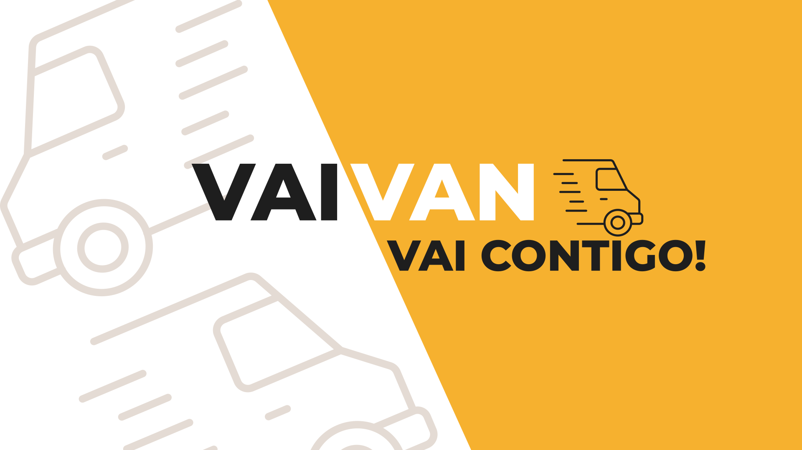

<p align="center">
  
</p>

<h1 align="center">🚐 VaiVan — VaiVan Vai Contigo!</h1>

O **VaiVan** é um aplicativo mobile desenvolvido para facilitar e organizar o gerenciamento do transporte escolar, conectando **responsáveis, passageiros e motoristas** em uma única plataforma.

O projeto foi desenvolvido como parte das atividades acadêmicas da **UniFTEC**, com foco em **Engenharia de Software e Empreendedorismo**, buscando aplicar conceitos de desenvolvimento mobile, persistência de dados, autenticação e organização de software.

> **VaiVan Vai Contigo!**

---

## 📱 Sobre o projeto

O transporte escolar envolve diferentes pessoas, informações e etapas que precisam estar organizadas: responsáveis, passageiros, motoristas, veículos, rotas, comunicação e acompanhamento.

O VaiVan propõe centralizar essas informações em um aplicativo, permitindo que os usuários tenham acesso aos recursos necessários de acordo com seu perfil.

A aplicação foi pensada para oferecer:

* Praticidade no gerenciamento do transporte;
* Maior transparência das informações;
* Organização de passageiros e rotas;
* Comunicação entre responsáveis e motoristas;
* Gerenciamento de veículos e documentos;
* Acompanhamento de informações relacionadas ao transporte.

---

## 🎯 Objetivos

### Objetivo geral

Desenvolver uma solução mobile para auxiliar no gerenciamento do transporte escolar, centralizando informações e facilitando a comunicação entre responsáveis e motoristas.

### Objetivos específicos

* Permitir o cadastro e autenticação de usuários;
* Gerenciar diferentes perfis de acesso;
* Cadastrar e acompanhar passageiros;
* Gerenciar motoristas e veículos;
* Organizar rotas de transporte;
* Permitir comunicação entre os usuários;
* Armazenar informações de forma persistente;
* Disponibilizar dados mesmo com limitações de conexão por meio de cache local;
* Aplicar uma arquitetura organizada e escalável.

---

## 👥 Perfis de usuário

O aplicativo trabalha com diferentes possibilidades de utilização.

### 👨‍👩‍👧 Responsável

O responsável pode utilizar o aplicativo para:

* Gerenciar passageiros;
* Consultar informações de transporte;
* Pesquisar rotas;
* Acompanhar informações relacionadas ao passageiro;
* Conversar com motoristas;
* Acessar seu perfil.

### 🚐 Motorista

O motorista possui recursos relacionados à operação do transporte, incluindo:

* Gerenciamento de informações pessoais;
* Cadastro de veículo;
* Envio de documentos;
* Gerenciamento de informações relacionadas às rotas;
* Comunicação com responsáveis;
* Acompanhamento do status de aprovação.

O cadastro do motorista possui diferentes estados, como:

`PENDENTE` → documentos ou informações ainda não enviados.

`EM_ANALISE` → documentação enviada e aguardando avaliação.

`ATIVO` → motorista aprovado e apto a utilizar os recursos destinados ao perfil.

`INATIVO` → perfil sem atuação como motorista.

---

## ✨ Funcionalidades

### 🔐 Autenticação

* Cadastro de usuários;
* Login com e-mail e senha;
* Login com Google;
* Verificação de e-mail;
* Controle de sessão;
* Seleção do tipo de perfil após o login.

### 👤 Usuários

* Cadastro de informações pessoais;
* CPF;
* Telefone;
* Data de nascimento;
* Endereço;
* Status do usuário;
* Controle de confirmação de e-mail.

### 🧒 Passageiros

* Cadastro de passageiros;
* Associação com responsável;
* Associação com motorista;
* Associação com rota;
* Informações relacionadas ao transporte.

### 🗺️ Rotas e localização

* Pesquisa de rotas;
* Utilização de mapas;
* Seleção de localização;
* Integração com serviços de localização do Google.

### 🚗 Motoristas e veículos

* Cadastro de motorista;
* Cadastro de veículo;
* Controle do status do motorista;
* Gerenciamento de documentação;
* Armazenamento de documentos.

### 💬 Comunicação

* Chat entre usuários;
* Mensagens armazenadas no Firebase;
* Atualização das mensagens em tempo real.

### 💾 Persistência e sincronização

O aplicativo utiliza uma estratégia híbrida de armazenamento:

**Firebase Firestore** é utilizado como fonte principal dos dados.

**Room** é utilizado como banco local para cache e observação dos dados pela interface.

A aplicação possui um mecanismo de sincronização responsável por manter os dados locais atualizados a partir do Firebase.

---

## 🏗️ Arquitetura

O projeto utiliza uma organização baseada em responsabilidades, separando as principais partes da aplicação.

```text
app/
├── core/
│   ├── sync/
│   └── util/
│
├── data/
│   ├── database/
│   ├── firestore/
│   ├── model/
│   └── repository/
│
├── domain/
│   └── usecase/
│
└── ui/
    ├── auth/
    ├── cadastro/
    ├── responsavel/
    ├── motorista/
    ├── passageiro/
    ├── chat/
    └── mapa/
```

### Core

Contém componentes utilizados por diferentes partes da aplicação, como:

* Utilitários;
* Sincronização;
* Configurações compartilhadas.

### Data

Responsável pelo acesso e gerenciamento dos dados.

Inclui:

* Entidades Room;
* DAOs;
* Firebase/Firestore;
* Repositórios;
* Modelos de dados.

### Domain

Contém a lógica de negócio da aplicação por meio dos **Use Cases**.

### UI

Responsável pelas telas e pela interação com o usuário.

---

## 🔄 Estratégia de dados

O VaiVan utiliza o Firebase como fonte principal dos dados e o Room como cache local.

```text
                ┌─────────────────┐
                │    Firebase     │
                │    Firestore    │
                └────────┬────────┘
                         │
                    Sincronização
                         │
                         ▼
                ┌─────────────────┐
                │      Room       │
                │   Banco local   │
                └────────┬────────┘
                         │
                         ▼
                ┌─────────────────┐
                │       UI        │
                │   Activities    │
                │   Fragments     │
                └─────────────────┘
```

A interface observa os dados locais por meio de `Flow`, enquanto operações de consulta e sincronização utilizam o Firebase.

Essa abordagem permite separar a interface da fonte de dados e possibilita trabalhar com informações armazenadas localmente.

---

## 🛠️ Tecnologias utilizadas

### Android

* **Kotlin**
* **Android SDK**
* **Android Studio**
* **Material Design**
* **ViewBinding**
* **Fragments**
* **Activities**

### Banco de dados

* **Firebase Firestore**
* **Firebase Authentication**
* **Firebase Storage**
* **Room**
* **KSP**

### APIs e serviços

* **Google Maps**
* **Google Places**
* **Firebase**

### Arquitetura e desenvolvimento

* Repository Pattern
* Use Cases
* Flow
* Coroutines
* Sincronização Firebase → Room
* Separação entre camadas

---

## 🔥 Firebase

O Firebase é utilizado em diferentes partes do sistema.

### Firebase Authentication

Responsável pela autenticação dos usuários.

Métodos utilizados:

* E-mail e senha;
* Google;
* Verificação de e-mail.

### Cloud Firestore

Responsável pelo armazenamento dos dados da aplicação.

Entre as principais coleções estão:

```text
usuarios
passageiros
motoristas
veiculos
rotas
mensagens
```

### Firebase Storage

Utilizado para armazenar arquivos relacionados aos usuários e veículos, principalmente documentos enviados durante o processo de cadastro e análise do motorista.

---

## 💾 Banco local

O **Room** funciona como uma camada de persistência local.

Exemplo de fluxo:

```text
Firebase
   ↓
SyncManager
   ↓
Repository
   ↓
Room
   ↓
Flow
   ↓
Fragment / Activity
```

As operações são separadas de acordo com sua finalidade:

* `observar()` → observa dados do Room;
* `consultar()` → consulta dados no Firebase;
* `sincronizar()` → atualiza o Room utilizando dados do Firebase;
* `salvar()` → persiste os dados;
* `excluir()` → remove os dados.

---

## 🔐 Segurança

O sistema utiliza autenticação do Firebase para identificar os usuários.

Os dados armazenados no Firestore são associados ao identificador do usuário autenticado, permitindo que as informações sejam relacionadas ao usuário correto.

As regras de segurança do Firestore são utilizadas para controlar o acesso aos dados.

---

## 📂 Estrutura do projeto

```text
VaiVan-Mobile
│
├── app
│   ├── src
│   │   └── main
│   │       ├── java/com/example/vaivan
│   │       │   ├── core
│   │       │   ├── data
│   │       │   ├── domain
│   │       │   └── ui
│   │       │
│   │       └── res
│   │
│   └── build.gradle.kts
│
├── build.gradle.kts
├── settings.gradle.kts
└── README.md
```

---

## 🎨 Interface

A interface do VaiVan utiliza uma identidade visual baseada principalmente em tons de **laranja, preto e tons claros**, buscando transmitir uma aparência moderna e relacionada ao conceito de mobilidade.

A aplicação utiliza componentes do **Material Design** e possui diferentes interfaces para os perfis de usuário.

Confira algumas das principais telas desenvolvidas para o aplicativo VaiVan:

### 🔐 Autenticação

|                 Login                |                  Cadastro                  |
| :----------------------------------: | :----------------------------------------: |
|  |  |

### 🏠 Área do responsável

|                      Home                      |                    Passageiros                   |
| :--------------------------------------------: | :----------------------------------------------: |
|  |  |

### 🗺️ Rotas e localização

|           Pesquisa de rotas          |                Mapa                |
| :----------------------------------: | :--------------------------------: |
|  |  |

### 💬 Comunicação

|                Chat                |                 Perfil                 |
| :--------------------------------: | :------------------------------------: |
|  |  |

🎨 Design no Figma

O projeto conta também com um protótipo desenvolvido no **Figma**, utilizado para planejar a interface, fluxo de navegação e identidade visual do VaiVan antes e durante o desenvolvimento do aplicativo.

**🔗 [Acessar o projeto no Figma](https://www.figma.com/design/1zOCbCfmw3bpuZutFZceJB/VainVan?node-id=0-1&t=SZIWUc6Ew6gl6ysO-1)**


---

## 🚀 Execução do projeto

### Pré-requisitos

Para executar o projeto, é necessário possuir:

* Android Studio;
* JDK compatível com a versão utilizada pelo projeto;
* Android SDK;
* Conta/projeto configurado no Firebase;
* Emulador Android ou dispositivo físico.

### Configuração

1. Clone o repositório:

```bash
git clone <URL_DO_REPOSITORIO>
```

2. Abra o projeto no Android Studio.

3. Configure o projeto Firebase.

4. Adicione o arquivo:

```text
google-services.json
```

na pasta:

```text
app/
```

5. Sincronize o Gradle.

6. Execute o aplicativo em um dispositivo ou emulador Android.

---

## 📌 Status do projeto

🚧 **Em desenvolvimento**

O projeto está sendo desenvolvido de forma incremental, com novas funcionalidades e melhorias sendo adicionadas durante o desenvolvimento acadêmico.

---

## 🎓 Contexto acadêmico

O VaiVan foi desenvolvido como projeto acadêmico na **UniFTEC**, envolvendo conceitos de:

* Engenharia de Software;
* Desenvolvimento Android;
* Banco de dados;
* Arquitetura de software;
* Requisitos de software;
* Autenticação;
* Persistência de dados;
* Integração com serviços externos;
* Empreendedorismo.

---

## 👨‍💻 Desenvolvimento

Projeto desenvolvido por estudantes da **UniFTEC** como parte das atividades acadêmicas.

**VaiVan — VaiVan Vai Contigo! 🚐**
